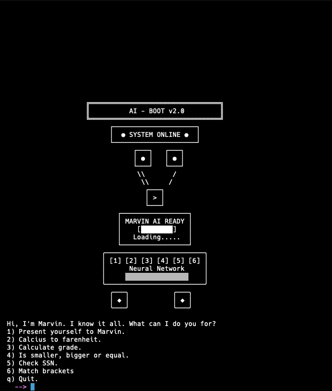

# python_moal25

# Redovisningstexter

## Kmom02

💡 Python-syntaxen känns överlag ganska logisk och läsbar jämfört med andra programmeringsspråk. Det som är bra är att koden nästan läser som engelska, till exempel när jag skriver if choice == "1": så förstår man direkt vad som händer. F-strings som f"Hello {name}" var också mycket enklare än att använda plus-tecken eller kommatecken för att sätta ihop strängar. Det som var lite krångligt i början var att vänja sig vid indentering istället för krullparenteser, och jag glömde ofta bort kolontecknet efter if, while och for-satser.

📂 Programmets struktur blev ganska tydlig med huvudloopen while not stop: och sedan alla menyval med if/elif/else-kedjor. Det blev ett naturligt flöde där användaren väljer något, programmet gör beräkningen, skriver ut resultatet och går tillbaka till menyn. Koden blev lite lång mot slutet men strukturen var ändå lätt att följa. Jag kunde ha delat upp det i funktioner men det kändes för avancerat för detta moment.

🔁 Loopar har jag fått en bra förståelse för genom att använda dem i olika situationer. For-loopar använder jag när jag vet exakt hur många gånger något ska upprepas, som när jag går igenom alla bokstäver i ett ord eller alla siffror i personnumret. While-loopar passar bättre när jag vill fortsätta tills något specifikt händer, som i menyval 4 där programmet fortsätter ta emot nummer tills användaren skriver "done". Skillnaden blev tydlig när jag implementerade de olika valen – for-loop för att gå igenom personnumrets 10 siffror, men while-loop för att vänta på användarinput.

📚 Listor hade jag tidigare erfarenhet av från C++, så när jag skrev numbers = [] så förstod jag grundprincipen, men Python gör det mycket enklare. I C++ skulle jag behöva deklarera typ och storlek, men här skapar jag bara en tom lista och kan lägga till element med append(). Det som var skönt var att Python automatiskt hanterar minnesstorlek och jag slipper oroa mig för pointers eller array-gränser som i C++. När jag använder numbers[-1] för att komma åt sista elementet så är det så mycket enklare än att hålla reda på index manuellt.

⚖️ Ett bra exempel där while-loop passar bättre är när man väntar på korrekt input från användaren – man vet inte hur många försök det kommer ta. Medan for-loop passar perfekt när man ska göra något med varje element i en lista eller varje tecken i en sträng, eftersom man vet exakt hur många iterationer som behövs.

✅ Valideringen av uppgifterna gick bra tack vare try/except-block som förhindrar programmet från att krascha när användare matar in fel data. Jag lärde mig att alltid kontrollera input innan jag använder det i beräkningar. För personnummervalidering blev det lite mer komplicerat eftersom jag behövde kontrollera både längd, att det bara innehåller siffror, och sedan implementera Luhn-algoritmen som jag hittade online. I menyval 4 använde jag först float() istället för int() eftersom jag tänkte att man skulle kunna jämföra decimaler också, men sedan ändrade jag till int() för att följa uppgiften där det stod heltal. Det gjorde att funktionen blev mer korrekt enligt instruktionen, men det hade också varit intressant att behålla float() för att göra programmet mer flexibelt. Jag lade också till att programmet visar upp vad användaren har skrivit när det blir ett ogiltigt menyval, vilket gör det tydligare varför det blev fel.

🎯 Uppgifterna varierade i svårighet – de första valen som bara hanterar namn och temperaturkonvertering var ganska enkla. Betygsberäkningen var lite svårare med alla if/elif-satser. Jämförelsefunktionen blev knepigare eftersom jag behövde hålla reda på tidigare nummer i en lista och få jämförelsen att fungera korrekt. Personnummervalidering var definitivt svårast och jag fick googla hur Luhn-algoritmen fungerar och sedan förenkla den till något jag förstod. Rövarspråket var roligt men tog tid att få rätt med alla vowel-kontroller.

🎨 Färghanteringen var kul men lite krånglig – jag hittade ANSI-färgkoderna online och experimenterade med olika sätt att använda dem. Först var jag konsekvent med att alltid återställa färgerna, men sedan blev det lite rörigt när jag testade olika varianter. Jag ville även lägga till emojis för att göra det roligare, men tog bort dem i sista minuten eftersom det såg för plottrigt ut.

✨ Min största TIL för detta kmom02 är hur viktigt input-validering är eftersom användare alltid hittar sätt att skriva fel saker. Try/except-block räddade mig många gånger från kraschande program. Jag lärde mig också att f-strings gör utskrifter mycket enklare och att while True med break är ett smidigt sätt att hantera input-loopar. Indentering i Python var ovant först men tvingar en faktiskt att skriva snyggare kod. Det mest utmanande var personnummervalidering där jag fick lära mig en helt ny algoritm, men det mest givande var att se hur programmet växte från enkla menyval till mer komplexa funktioner steg för steg. Python är verkligen mycket mer tillgängligt och användarvänligt än C++, särskilt när det gäller stränghantering och listoperationer.

