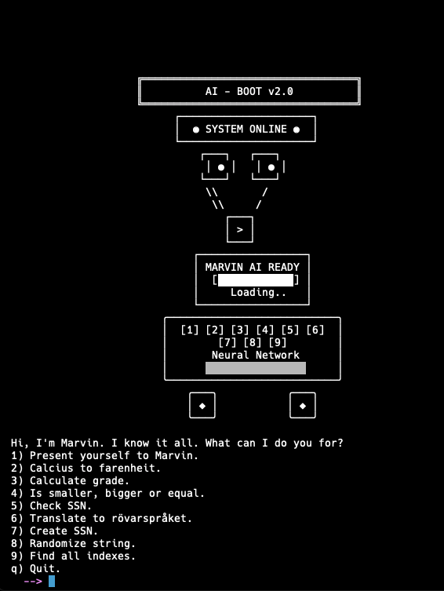

# python_moal25

# Redovisningstexter

# Kmom02 && Kmom03

🐍 Python börjar verkligen kännas som ett riktigt kraftfullt språk nu! Efter att ha gått igenom både kmom02 och kmom03 så ser jag hur språket utvecklas från enkla grunder till något som faktiskt kan bygga komplexa, välstrukturerade program. Trots att jag hade viss tidigare erfarenhet av funktioner och moduler från andra programmeringsspråk så blev övergången från kmom02 till kmom03 ändå en riktigt lärorik upplevelse. Det visade sig att det inte bara handlar om att kunna grunderna - det handlar om hur Python gör saker på sitt eget sätt, och hur mycket funktioner och moduler förändrar allt. Från en 180-raders monster-fil i kmom02 till tre organiserade filer i kmom03 där varje funktion har sitt syfte. Jag förstår nu varför alla säger att man ska dela upp koden - det är så mycket enklare att underhålla och hitta fel i. Random-modulen var kul att upptäcka, och string-metoder som index() öppnade upp nya möjligheter. Det mest givande var att se hur min tidigare kunskap kunde byggas ut och förfinas genom Python's eleganta approach.

📜 I kmom02 hade jag all kod i en enda stor fil och även om Python-syntaxen kändes logisk från början så blev strukturen rörig när komplexiteten ökade. F-strings som f"Hello {name}" var mycket smidigare än concatenation-metoder jag var van vid, och det som tog mest tid var att anpassa mig till indenteringen istället för krullparenteser. Jag byggde upp programmet med en stor while not stop: loop och massa if/elif/else för menyval, vilket fungerade för det momentet men jag märkte redan då att det inte var hållbart i längden. De enklaste uppgifterna i kmom02 var greet-funktionaliteten och temperaturkonverteringen eftersom de bara krävde grundläggande input/output och enkla matematiska beräkningar. Betygsberäkningen med alla if/elif-satser för olika grader var också ganska rakt på sak även om det blev många rader kod.

⚙️ När jag kom till kmom03 och fick tillämpa funktionskunskaper i Python blev skillnaden dramatisk. Att definiera funktioner med def funktionsnamn(): kändes bekant från tidigare språk, men Python's sätt att hantera return-värden och parametrar hade sina egna nyanser. Jag glömde return-satsen flera gånger i början - speciellt i create_ssn() där jag fick "None" tillbaka innan jag insåg vad som saknades. Det som var mest annorlunda var hur smidig och intuitiv modulhanteringen var, även om import-syntaxen krävde lite inlärning. Att strukturera koden i main.py för menyn, marvin1.py för refaktoriserade funktioner från kmom02, och marvin2.py för nya avancerade funktioner förvandlade helt programmet. Med import marvin1 och import marvin2 kunde jag använda marvin1.greet() och marvin2.create_ssn() på ett naturligt sätt, men det som blev lite knepigt var när jag ville återanvända calculate_luhna_sum() från marvin1.py inne i marvin2.py - då upptäckte jag skillnaden mellan import marvin1 och from marvin1 import calculate_luhna_sum.

✅ De lättaste uppgifterna i kmom03 var definitivt att konvertera alla gamla funktioner från kmom02 till separata funktioner i marvin1.py eftersom det mest var copy-paste och lägga def framför, plus lite refactoring för att ta bort globala variabler. Greet(), celsius_to_fahrenheit(), och points_to_grade() var rakt på sak - bara flytta koden från if-satserna och wrappa dem i funktioner. Validate_ssn() var också lätt att konvertera eftersom logiken redan fanns klar från kmom02, jag behövde bara extrahera Luhn-beräkningen till calculate_luhna_sum() för återanvändning. Rövarspråket var roligt och ganska enkelt att implementera som funktion eftersom logiken redan var genomtänkt - bara gå igenom varje bokstav, kolla om det är en vokal, och om inte lägg till "o" plus lowercase-versionen.

😤 Men den absolut svåraste uppgiften var randomize_string() i marvin2.py som fick mig att fastna i flera timmar. Först tänkte jag att det skulle vara enkelt med random.shuffle(), men då insåg jag att shuffle() ändrar listan på plats och jag ville inte använda listor eftersom vi inte hade lärt oss dem ordentligt än. Jag försökte olika approaches innan jag kom fram till en algoritm där jag skapar en tom result-sträng, och sedan i en while-loop väljer ett random index från den kvarvarande strängen, lägger till det tecknet i result, och tar bort det från temp_string med slicing. Det som tog längst tid var att få till string slicing-delen temp_string[:random_index] + temp_string[random_index + 1:] eftersom jag inte var van vid Python's slicing-syntax och det kändes så annorlunda från andra språk jag jobbat med.

🔍 Find_all_indexes() var också riktigt utmanande på ett annat sätt. I början försökte jag bara använda string.find() i en loop, men sedan upptäckte jag att index() kastar ValueError när den inte hittar något, vilket faktiskt är perfekt för min while True loop med try/except. Det svåra var att hantera start-positionen korrekt och bygga upp result-strängen med kommatecken mellan indexen - först hade jag alltid ett extra kommatecken i början eller slutet, så jag fick göra en if-sats för första träffen och sedan lägga till komma plus index för resten. SSN-generering i create_ssn() var utmanande av en tredje anledning eftersom det inte bara handlade om algoritmen utan även att förstå hur Luhn-checksumman fungerar i omvänd riktning. Jag hade calculate_luhna_sum() från kmom02, men nu skulle jag generera den sista siffran så att summan blev delbar med 10, och formeln (10 - (luhn_sum % 10)) % 10 tog tid att förstå och verifiera med olika personnummer.

🔧 Det som tog mest tid var faktiskt inte själva uppgifterna utan att få modulerna att fungera tillsammans. I början importerade jag bara import marvin1 i marvin2.py och försökte använda marvin1.calculate_luhna_sum(), men det fungerade inte som förväntat. Sedan testade jag from marvin1 import * vilket fungerade men kändes fel, och till slut lärde jag mig att from marvin1 import calculate_luhna_sum var det rätta sättet, fast det tog tid att förstå varför. Main.py blev faktiskt ganska enkel att skriva när jag väl hade alla funktioner på plats eftersom det bara blev en ren meny-handler med funktionsanrop, mycket cleanare än den långa if/elif-kedjan från kmom02.

🎯 Min tidigare erfarenhet hjälpte definitivt med att förstå funktionsflöde, parameterhantering och återanvändbarhet, men Python's specifika sätt att hantera namespaces och modulorganisation var nytt territorium. Det som slog mig var hur mycket mer elegant Python gör vissa saker - string-hantering med inbyggda metoder som index(), random-modulens enkelhet för SSN-generering, och hur naturligt det känns att organisera funktionalitet i separata moduler. Min största TIL för dessa kursmomenten är hur Python kombinerar välbekanta programmeringskoncept med sina egna eleganta, pythoniska lösningar. Resan från 180 rader organisk kod till välstrukturerade, återanvändbara moduler demonstrerade verkligen kraften i god arkitektur, och Python's rika ekosystem av bibliotek som random, kombinerat med kraftfulla inbyggda string-metoder, gör komplexa uppgifter förvånansvärt tillgängliga. Det mest meningsfulla var att upptäcka hur tidigare programmeringskunskaper inte bara kunde överföras till Python, utan faktiskt fördjupas och förbättras genom språkets unika filosofi och design.